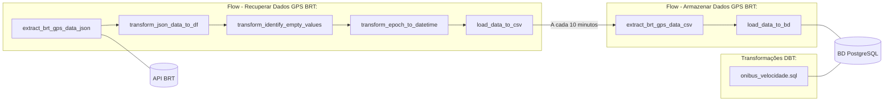

# Desafio de Data Engineer - EMD

## Descrição do desafio
_Retirada do Repositório Original e Adaptada para tópicos_

- Neste desafio você deverá capturar, estruturar, armazenar e transformar dados de uma API instantânea. 
- A API consiste nos dados de GPS do BRT que são gerados na hora da consulta com o último sinal transmitido por cada veículo.
- Para o desafio, será necessário construir uma pipeline que captura os dados minuto a minuto e gera um arquivo no formato CSV. 
- O arquivo gerado deverá conter no mínimo 10 minutos de dados capturados (estruture os dados da maneira que achar mais conveniente), então carregue os dados para uma tabela no Postgres. 
- Por fim, crie uma tabela derivada usando o DBT. A tabela derivada deverá conter o ID do onibus, posição e sua a velocidade.
- A pipeline deverá ser construída subindo uma instância local do Prefect (em Python). Utilize a versão *0.15.9* do Prefect.

## Arquitetura da Solução


## Organização do Projeto

- `analysis/`: onde ficam os notebooks de análise de dados, utilizados para detectar quais seriam os campos do banco e quais tratamentos seriam necessários para os dados;
- `database/`: onde ficam os arquivos relacionados ao banco de dados PostgreSQL: o configurador do orquestrador e o arquivo SQL de inicialização do banco;
- `transformations/`: onde fica o projeto DBT, com os modelos e outros arquivos relevantes de transformação de dados;
- `pipelines/`: onde ficam os arquivos relacionado ao pipeline Prefect de ETL.

## Ambiente de Execução

### Preparação de Banco de Dados

1. Tenha `docker` e `docker-compose` instalados
1. Entre na pasta `database/`
1. Rode `docker-compose up` no terminal
1. O banco de dados Postgres deve estar disponível:
    - Host/Post: localhost:5432
    - DB Name: brt_gps
    - Usuário: admin
    - Senha: password

### Preparação de Pipelines

1. Crie um ambiente virtual usando `venv`
    - Windows: `python -m venv .\env`
    - Linux: `python -m venv env`
1. Ative o ambiente virtual
    - Windows: `env\Scripts\Activate.ps1`
    - Linux: `source env/bin/activate`
1. Instale as dependências definidas em `requirements.txt`:
    - Windows: `pip install -r requirements.txt`
    - Linux: `pip install -r requirements.txt`

### Preparação DBT

1. Configure os dados do banco em:
    - Windows: `C:\Users\[NOME_USUARIO]\.dbt\profiles.yml`
    - Linux: `~/dbt/profiles.yml`

### Rodando

1. Garanta que o container docker do banco de dados está ativo (`docker-compose up`)
1. Ative o ambiente virtual
    - Windows: `env\Scripts\Activate.ps1`
    - Linux: `source env/bin/activate`
1. Rode na raiz do projeto o comando: `python run.py`

## Debugging

### Preparação

1. Utilizando VSCode, crie uma pasta na raiz `.vscode`
1. Crie um arquivo `launch.json` e cole o seguinte conteúdo nele:
```json
{
    "version": "0.2.0",
    "configurations": [
        {
            "name": "Projeto",
            "type": "python",
            "request": "launch",
            "program": "run.py",
            "console": "integratedTerminal",
            "justMyCode": true
        }
    ]
}
```
### Depurando

1. Entre na seção "Run and Debug" na barra lateral esquerda
1. Clique em Play
